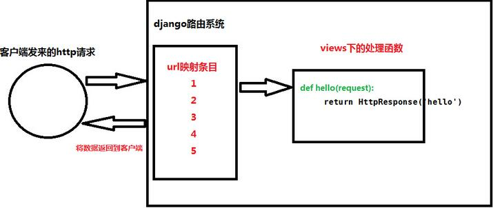

# Django路由系统

 简而言之，django的路由系统作用就是使views里面处理数据的函数与请求的url建立映射关系。使请求到来之后，根据urls.py里的关系条目，去查找到与请求对应的处理方法，从而返回给客户端http页面数据。
 
 
 
##一、最基础的url映射
<pre>
from django.conf.urls import patterns, include, url

from django.contrib import admin
admin.autodiscover()
from apptest import views

urlpatterns = patterns('',
    url(r'^admin/', include(admin.site.urls)),
    url(r'^index/$', views.index),
)

</pre>

1. 先从创建的app下的views.py面定义处理数据的函数

2. 在urls.py里导入views

3. 在urlpatterns里写入一条url与处理函数的l映射关系

4. url映射一般是一条正则表达式，“^” 字符串的开始，“$“ 字符串的结束

5. 当写成”^$“时，不输入任何url时不会在返回黄页，而是返回后面函数里对应的页面。一般这一条会写在url的最后。如：

<pre>
url(r'^```, views.index),
</pre>

##二、按照顺序放置的动态路由

<pre>
 urlpatterns = [
     url(r'^user/(\d+)$', views.user),
     url(r'^user_list/(\d+)/(\d+)$', views.user_list),
 
 ]
 </pre>
 
* ^user/(\d+)$ 

相对应的url是： ”http://127.0.0.1/uer/8“ (\d+)是匹配任意的数字，在分页时灵活运用。

*　^user_list/(\d+)/(\d+)$

相对应的url是： ”http://127.0.0.1/uer/8/9“，匹配到的数字会以参数的形式按照顺序传递给views里面相对应的函数

<pre>def user_list(request,nid,nid2):
 
     return HttpResponse(nid+nid2)
</pre>

##三、传参形式的动态路由

利用正则表达式的分组方法，将url以参数的形式传递到函数，可以不按顺序排列。
 
 ```
 urlpatterns = [
 url(r'^user_list/(?P<v1>\d+)/(?P<v2>\d+)$',views.user_list),
 ]
 ```
 
 ```
(?P<v1>\d+)
```

正则表达式的分组，相当于一个字典， key=v1, value=\d+。 {"v1":"\d+"}
然后将此参数传递到views里对应的函数，可以不按照顺序

<pre>
 def user_list(request,v2,v1): 
     return HttpResponse(v1+v2)
</pre>


```
参数v1 = (?P<v1>\d+)

参数v2 = (?P<v2>\d+)

```
##四、根据不同的app来分发不同的url

如果一个项目下有很多的app，那么在urls.py里面就要写巨多的urls映射关系。这样看起来很不灵活，而且杂乱无章。

我们可以根据不同的app来分类不同的url请求。

首先，在urls.py里写入urls映射条目。注意要导入include方法

```
from django.conf.urls import include, url
from django.contrib import admin

urlpatterns = [

    url(r'^app01/', include('app01.urls')),

]
```