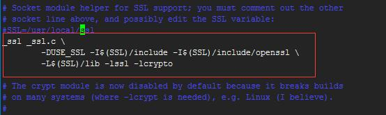

# 一 、安装pip工具

```
wget https://bootstrap.pypa.io/get-pip.py

\mv /usr/bin/python /usr/bin/python2.6 
ln -s /opt/python/bin/python /usr/bin/
python get-pip.py
ln -s /opt/python/bin/pip /usr/bin/
ln -s /opt/python/bin/easy_install* /usr/bin/
python -V
sed -i 's/python/python2.6/g' /usr/bin/yum
```

# 二、Ubuntu系统（建议使用Ubuntu15.10桌面）

```
默认安装，无需安装
 sudo apt-get install python2.7
安装pip
sudo apt-get install python-pip
```

# 三、源码安装适应各种平台

```
获得root权限
到上述地址下载某种版本的python:
wget https://www.python.org/ftp/python/2.7.9/Python-2.7.9.tgz
解压缩：tar xfz Python-2.7.8.tgz
进入该目录：cd Python-2.7.8
配置： ./configure --prefix=/opt/python
在上述文件夹内运行：make，然后运行：make install
祝你幸运
安装完毕
建议使用python2.7以上。
easy_install和pip安装
```

方法一：

python 默认源码安装没有安装openssl  
apt-get install libssl-dev  
重新编译python  
编辑 Modules/Setup去掉注释

然后make && make install  
下载地址:[https://pypi.python.org/pypi/ez\_setup](https://pypi.python.org/pypi/ez_setup)

解压执行  
/opt/python2/bin/python ez\_setup.py  
/opt/python2/bin/easy\_install pip  
方法二：  
[https://pip.pypa.io/en/latest/installing/](https://pip.pypa.io/en/latest/installing/)  
wget [https://bootstrap.pypa.io/get-pip.py](https://bootstrap.pypa.io/get-pip.py)  
python get-pip.py  
如果想升级安装pip  
pip install --upgrade pip  
四、配置不同的python虚拟环境  
参考：  
[https://virtualenv.pypa.io/en/stable/installation/](https://virtualenv.pypa.io/en/stable/installation/)

pip install virtualenv

virtualenv安装完毕后，可以通过运行下面的命令来为你的项目创建独立的python环境：  
mkdir test

virtualenv --distribute test

激活环境  
bin/activate.bat

退出环境  
bin/deactivate.bat  
参数详解：  
-distribute 选项使virtualenv使用新的基于发行版的包管理系统而不是 setuptools 获得的包。  
你现在需要知道的就是 --distribute 选项会自动在新的虚拟环境中安装 pip ，这样就不需要手动安装了。  
查看已经安装的模块：  
help\('modules'\)安装pip工具  
wget [https://bootstrap.pypa.io/get-pip.py](https://bootstrap.pypa.io/get-pip.py)

\mv /usr/bin/python /usr/bin/python2.6  
ln -s /opt/python/bin/python /usr/bin/  
python get-pip.py  
ln -s /opt/python/bin/pip /usr/bin/  
ln -s /opt/python/bin/easy\_install\* /usr/bin/  
python -V  
sed -i 's/python/python2.6/g' /usr/bin/yum

二、Ubuntu系统（建议使用Ubuntu15.10桌面）  
默认安装，无需安装  
 sudo apt-get install python2.7

安装pip  
sudo apt-get install python-pip

三、源码安装适应各种平台  
获得root权限  
到上述地址下载某种版本的python:  
wget [https://www.python.org/ftp/python/2.7.9/Python-2.7.9.tgz](https://www.python.org/ftp/python/2.7.9/Python-2.7.9.tgz)  
解压缩：tar xfz Python-2.7.8.tgz  
进入该目录：cd Python-2.7.8  
配置： ./configure --prefix=/opt/python  
在上述文件夹内运行：make，然后运行：make install  
祝你幸运  
安装完毕  
建议使用python2.7以上。  
easy\_install和pip安装

方法一：

python 默认源码安装没有安装openssl  
apt-get install libssl-dev  
重新编译python  
编辑 Modules/Setup去掉注释

然后make && make install  
下载地址:[https://pypi.python.org/pypi/ez\_setup](https://pypi.python.org/pypi/ez_setup)

解压执行  
/opt/python2/bin/python ez\_setup.py  
/opt/python2/bin/easy\_install pip  
方法二：  
[https://pip.pypa.io/en/latest/installing/](https://pip.pypa.io/en/latest/installing/)  
wget [https://bootstrap.pypa.io/get-pip.py](https://bootstrap.pypa.io/get-pip.py)  
python get-pip.py  
如果想升级安装pip  
pip install --upgrade pip  
四、配置不同的python虚拟环境  
参考：  
[https://virtualenv.pypa.io/en/stable/installation/](https://virtualenv.pypa.io/en/stable/installation/)

pip install virtualenv

virtualenv安装完毕后，可以通过运行下面的命令来为你的项目创建独立的python环境：  
mkdir test

virtualenv --distribute test

激活环境  
bin/activate.bat

退出环境  
bin/deactivate.bat  
参数详解：  
-distribute 选项使virtualenv使用新的基于发行版的包管理系统而不是 setuptools 获得的包。  
你现在需要知道的就是 --distribute 选项会自动在新的虚拟环境中安装 pip ，这样就不需要手动安装了。  
查看已经安装的模块：  
help\('modules'\)

yum -y install gcc gcc-c++ make autoconf  
wget [http://lnmpsoft.b0.upaiyun.com/python/Python-2.7.10.tgz](http://lnmpsoft.b0.upaiyun.com/python/Python-2.7.10.tgz)  
tar xf Python-2.7.10.tgz && cd Python-2.7.10  
./configure --prefix=/opt/python &&  make all  &&  make install

```
#安装pip工具

wget https://bootstrap.pypa.io/get-pip.py

\mv /usr/bin/python /usr/bin/python2.6 
ln -s /opt/python/bin/python* /usr/bin/
 python  get-pip.py
ln -s /opt/python/bin/pip*  /usr/bin/
ln -s /opt/python/bin/easy_install*  /usr/bin/
 python -V
sed -i 's/python/python2.6/g' /usr/bin/yum
```

## 二、Ubuntu系统（建议使用Ubuntu15.10桌面）

```
#默认安装，无需安装
 sudo apt-get install python2.7
#安装pip
sudo apt-get install  python-pip
```

## 三、源码安装适应各种平台

```
1. 获得root权限
2.  到上述地址下载某种版本的python: 
3.  wget https://www.python.org/ftp/python/2.7.9/Python-2.7.9.tgz
4.   解压缩：tar xfz Python-2.7.8.tgz
5.   进入该目录：cd Python-2.7.8
6.   配置： ./configure --prefix=/opt/python
7.   在上述文件夹内运行：make，然后运行：make install
8.   祝你幸运
9.   安装完毕

建议使用python2.7以上。
```

easy\_install和pip安装

方法一：

```
#python 默认源码安装没有安装openssl
#apt-get install libssl-dev
#重新编译python
#编辑 Modules/Setup去掉注释



然后make && make install

#下载地址:https://pypi.python.org/pypi/ez_setup
#解压执行
/opt/python2/bin/python ez_setup.py 
/opt/python2/bin/easy_install  pip
```

方法二：

```
https://pip.pypa.io/en/latest/installing/
wget https://bootstrap.pypa.io/get-pip.py
python get-pip.py

如果想升级安装pip
pip install --upgrade pip
```

## 四、配置不同的python虚拟环境

参考：

[https://virtualenv.pypa.io/en/stable/installation/](https://virtualenv.pypa.io/en/stable/installation/)

`pip install virtualenv`

virtualenv安装完毕后，可以通过运行下面的命令来为你的项目创建独立的python环境：

```
mkdir test

virtualenv --distribute test

激活环境
bin/activate.bat

退出环境
bin/deactivate.bat
```

参数详解：

-distribute 选项使virtualenv使用新的基于发行版的包管理系统而不是 setuptools 获得的包。

你现在需要知道的就是 --distribute 选项会自动在新的虚拟环境中安装 pip ，这样就不需要手动安装了。

查看已经安装的模块：

```
help('modules')
```


