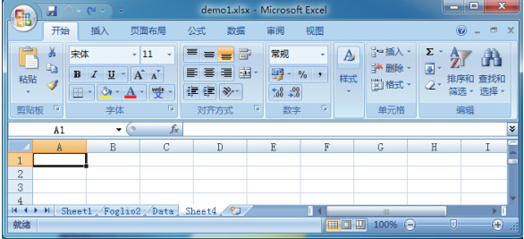

# Python之XlsxWriter（Excel操作模块）


以下演示基本excel操作

```
#!/usr/bin/env python
#-*- coding:utf-8 -*-

import xlsxwriter

workbook = xlsxwriter.Workbook('demo1.xlsx') #创建一个Excel文件
worksheet = workbook.add_worksheet()  #创建一个工作表对象
worksheet.set_column("A:A",20) #设定第一列（A）宽度为20像素

bold = workbook.add_format({'bold':True}) #定义一个加粗的格式对象
worksheet.write('A1','Hello') #A1单元格写入'Hello'
worksheet.write('A2', 'World', bold)    #A2单元格写入'World'并引用加粗格式对象bold
worksheet.write('B2', u'中文测试', bold)    #B2单元格写入中文并引用加粗格式对象bold

worksheet.write(2, 0, 32)    #用行列表示法写入数字'32'与'35.5'
worksheet.write(3, 0, 35.5)    #行列表示法的单元格下标以0作为起始值，'3,0'等价于'A3'
worksheet.write(4, 0, '=SUM(A3:A4)')    #求A3:A4的和，并将结果写入'4，0'，即'A5'

worksheet.insert_image('E10', 'img/python-logo.png')    #在B5单元格插入图片
workbook.close()    #关闭Excel文件
```

##1. Workbook类

Workbook类定义：Workbook(filename[, options])，该类实现创建一个XlsxWriter的Workbook对象。Workbook类代表整个电子表格文件，并且存储在磁盘上。参数filename（String类型）为创建的Excel文件存储路径；参数options（Dict类型）为可选的Workbook参数，一般作为初始化工作表内容格式，例如值为{'strings_to_numbers': True}表示使用worksheet.write()方法时激活字符串转换数字。
add_worksheet([sheetname])方法，作用是添加一个新的工作表，参数sheetname（String类型）为可选的工作表名称，默认为Sheet1。

例如：

``` 
worksheet1 = workbook.add_worksheet()             # Sheet1
worksheet2 = workbook.add_worksheet('Foglio2')    # Foglio2
worksheet3 = workbook.add_worksheet('Data')       # Data
worksheet4 = workbook.add_worksheet()             # Sheet4

```


add_format([properties])方法，作用是在工作表中创建一个新的格式对象来格式化单元格。参数properties（dict类型）为指定一个格式属性的字典，例如设置一个加粗的格式对象，workbook.add_format({'bold': True})。通过Format methods（格式化方法）也可以实现格式的设置，等价的设置加粗格式代码如下：

```
bold = workbook.add_format()
bold.set_bold()
```
更多格式化方法见http://xlsxwriter.readthedocs.org/working_with_formats.html。

add_chart（options）方法，作用是在工作表中创建一个图表对象，内部是通过insert_chart()方法来实现，参数options（dict类型）为图表指定一个字典属性，例如设置一个线条类型的图表对象，代码为

```
chart = workbook.add_chart({'type': 'line'})

```

close()方法，作用是关闭工作表文件，如workbook.close()。


##2. Worksheet类

Worksheet类代表了一个Excel工作表，是XlsxWriter模块操作Excel内容最核心的一个类，例如将数据写入单元格或工作表格式布局等。Worksheet对象不能直接实例化，取而代之的是通过Workbook对象调用add_worksheet()方法来创建。Worksheet类提供了非常丰富的操作Excel内容的方法，其中几个常用的方法如下：


* write(row, col, *args)方法，作用是写普通数据到工作表的单元格，参数row为行坐标，col为列坐标，坐标索引起始值为0；*args无名字参数为数据内容，可以为数字、公式、字符串或格式对象。为了简化不同数据类型的写入过程，write方法已经作为其他更加具体数据类型方法的别名，包括：
* ite_string()    写入字符串类型数据，如：

```worksheet.write_string(0, 0, 'Your text here')；```

* ite_number()    写入数字类型数据，如：

```worksheet.write_number('A2', 2.3451)；```

 * write_blank()    写入空类型数据，如：

```worksheet.write('A2', None)；```

 * write_formula()    写入公式类型数据，如：

```worksheet.write_formula(2, 0, '=SUM(B1:B5)')；```

 * write_datetime()    写入日期类型数据，如：
 
```worksheet.write_datetime(7, 0,datetime.datetime.strptime('2013-01-23', '%Y-%m-%d'),workbook.add_format({'num_format': 'yyyy-mm-dd'}))；```
 
 * write_boolean()    写入逻辑类型数据，如：
 
```worksheet.write_boolean(0, 0, True)；```
 
 * write_url()    写入超链接类型数据，如：

```worksheet.write_url('A1', 'ftp://www.python.org/')。```

下列通过具体的示例来观察别名write方法与数据类型方法的对应关系，代码如下：

```
worksheet.write(0, 0, 'Hello')          # write_string()
worksheet.write(1, 0, 'World')          # write_string()
worksheet.write(2, 0, 2)                # write_number()
worksheet.write(3, 0, 3.00001)          # write_number()
worksheet.write(4, 0, '=SIN(PI()/4)')   # write_formula()
worksheet.write(5, 0, '')               # write_blank()
worksheet.write(6, 0, None)             # write_blank()

```
* set_row（row, height, cell_format, options）方法，作用是设置行单元格的属性。参数row（int类型）指定行位置，起始下标为0；参数height（float类型）设置行高，单位像素；参数cell_format（format类型）指定格式对象；参数options（dict类型）设置行hidden（隐藏）、level（组合分级）、collapsed（折叠）。操作示例如下：

```
worksheet.write('A1', 'Hello')                  #在A1单元格写入'Hellow'字符串
cell_format = workbook.add_format({'bold': True})    #定义一个加粗的格式对象
worksheet.set_row(0, 40, cell_format)    #设置第1行单元格高度为40像素，且引用加粗
                                         #格式对象
worksheet.set_row(1, None, None, {'hidden': True})    #隐藏第2行单元格
 
```

* set_column（first_col, last_col, width, cell_format, options）方法，作用为设置一列或多列单元格属性。参数first_col（int类型）指定开始列位置，起始下标为0；参数last_col（int类型）指定结束列位置，起始下标为0，可以设置成与first_col一样；参数width（float类型）设置列宽；参数cell_format（Format类型）指定格式对象；参数options（dict类型）设置行hidden（隐藏）、level（组合分级）、collapsed（折叠）。

操作示例如下：

```
worksheet.write('A1', 'Hello')     #在A1单元格写入'Hello'字符串
worksheet.write('B1', 'World')     #在B1单元格写入'World'字符串
cell_format = workbook.add_format({'bold': True})    #定义一个加粗的格式对象
#设置0到1即(A到B) 列单元格宽度为10像素，且引用加粗格式对象
worksheet.set_column(0,1, 10,cell_format)
worksheet.set_column('C:D', 20)    #设置C到D列单元格宽度为20像素
worksheet.set_column('E:G', None, None, {'hidden': 1})    #隐藏E到G列单元格
```

样式总结

|类别|	描述|	属性	|方法名|
|-|-|-|-|
|字体|	字体|	font_name|	set_font_name()|
||字体大小|	font_size|	set_font_size()|
||字体颜色|	font_color|	set_font_color()|
||加粗|	bold|	set_bold()|
||斜体|	italic|	set_italic()|
||下划线	|underline|	set_underline()|
||删除线|	font_strikeout|	set_font_strikeout()|
||上标/下标	|font_script	|set_font_script()|
|数字	|数字格式|	num_format|	set_num_format()|
|保护|	表格锁定	|locked	|set_locked()|
||隐藏公式	|hidden	|set_hidden()|
|对齐|	水平对齐	|align	|set_align()|
||垂直对齐|	valign	|set_align()|
||旋转	|rotation|	set_rotation()|
||文本包装|	text_wrap	|set_text_warp()|
||底端对齐	|text_justlast	|set_text_justlast()|
||中心对齐	|center_across|	set_center_across|
||缩进	|indent|	set_indent()|
||缩小填充|	shrink|	set_shrink()|
|模式|表格模式|pattern|	set_pattern()|
||背景颜色	|bg_color|	set_bg_color()|
||前景颜色	|fg_color|	set_fg_color()|
|边框	|表格边框|	border|	set_border()|
||底部边框|	bottom	|set_bottom()|
||上边框|	top|	set_top()|
||右边框	|right|	set_right()|
||边框颜色	|border_color|	set_border_color()|
||底部颜色	|bottom_color|	set_bottom_color()|
||顶部颜色	|top_color|	set_top_color()|
||左边颜色	|left_color	|set_left_color()|
||右边颜色	|right_color|	set_right_color()|


##3. Chart类
Chart类实现在XlsxWriter模块中图表组件的基类，支持的图表类型包括面积、条形图、柱形图、折线图、饼图、散点图、股票和雷达等，一个图表对象是通过Workbook（工作簿）的add_chart方法创建，通过{type, '图表类型'}字典参数指定图表的类型，语句如下：

```
chart = workbook.add_chart({type, 'column'})    #创建一个column(柱形)图表
```
更多图表类型说明：

* area：创建一个面积样式的图表；
* bar：创建一个条形样式的图表；
* column：创建一个柱形样式的图表；
* line：创建一个线条样式的图表；
* pie：创建一个饼图样式的图表；
* scatter：创建一个散点样式的图表；
* stock：创建一个股票样式的图表；
* radar：创建一个雷达样式的图表。

然后再通过Worksheet（工作表）的insert_chart()方法插入到指定位置，语句如下：

```
worksheet.insert_chart('A7', chart)    #在A7单元格插入图表

```
下面介绍chart类的几个常用方法。

chart.add_series (options)方法，作用为添加一个数据系列到图表，参数options (dict类型)设置图表系列选项的字典，操作示例如下：

```
chart.add_series({
    'categories': '=Sheet1!$A$1:$A$5',
    'values':     '=Sheet1!$B$1:$B$5',
    'line':       {'color': 'red'},
})
```
add_series方法最常用的三个选项为categories、values、line，其中categories作为是设置图表类别标签范围；values为设置图表数据范围；line为设置图表线条属性，包括颜色、宽度等。
其他常用方法及示例。

set_x_axis(options)方法，设置图表X轴选项，示例代码如下
```
chart.set_x_axis({
    'name': 'Earnings per Quarter',    #设置X轴标题名称
    'name_font': {'size': 14, 'bold': True},  #设置X轴标题字体属性
    'num_font':  {'italic': True },    #设置X轴数字字体属性
})
```

set_size(options)方法，设置图表大小，如chart.set_size({'width': 720, 'height': 576})，其中width为宽度，height为高度。

set_title(options)方法，设置图表标题，如chart.set_title({'name': 'Year End Results'})

